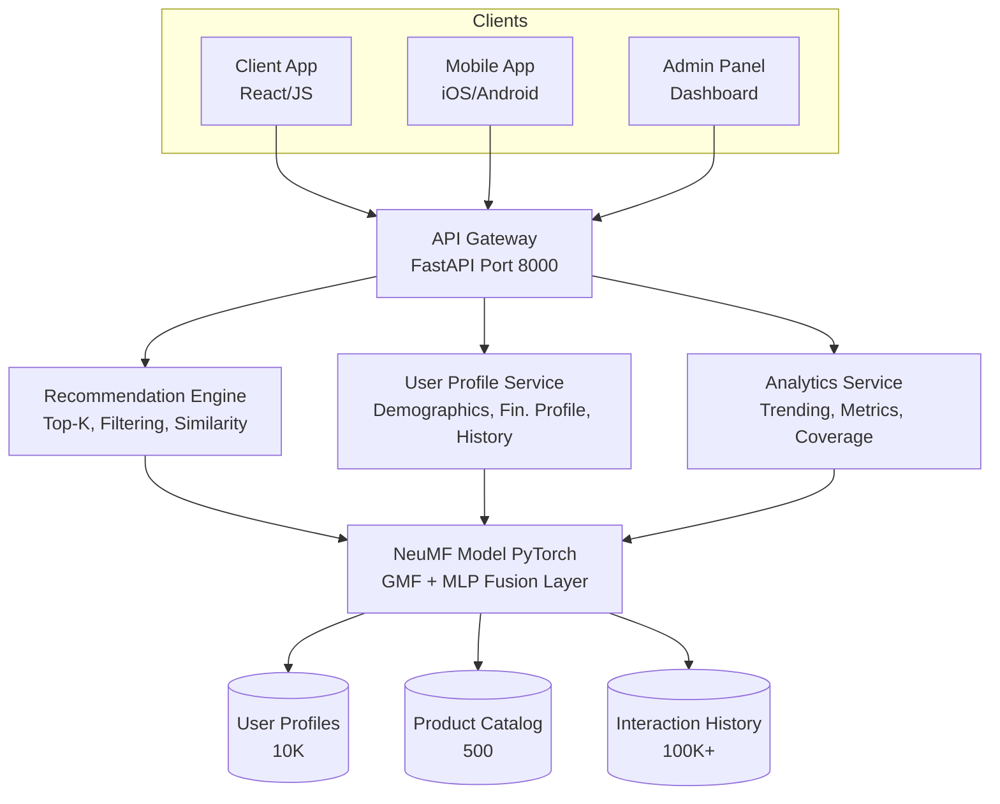
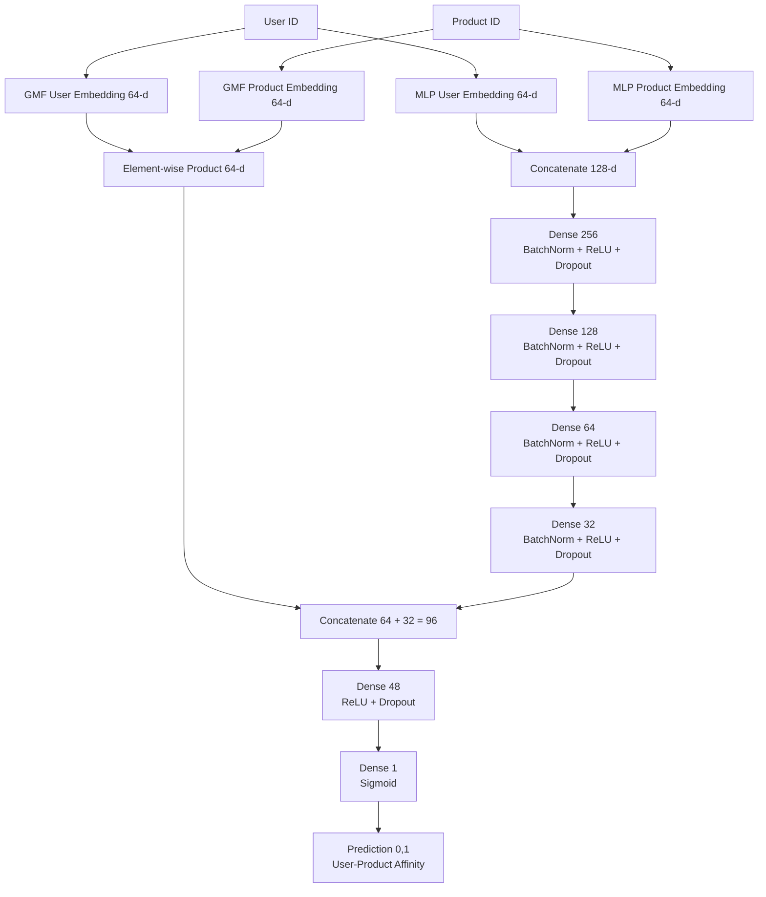
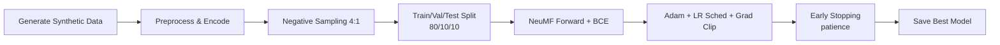
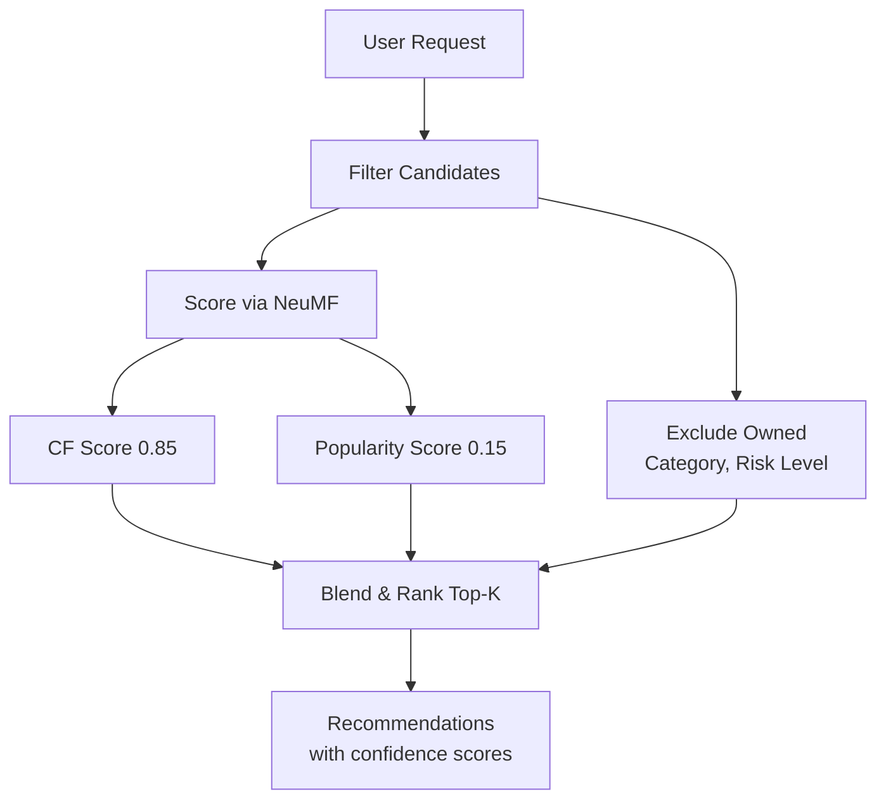

# Deep Learning Recommendation System for Financial Services

[](https://python.org)
[](https://pytorch.org)
[](https://fastapi.tiangolo.com)
[](LICENSE)
[](#testing)

A production-grade Neural Collaborative Filtering (NeuMF) recommendation engine that delivers personalized financial product suggestions, covering savings accounts, mortgages, investment funds, retirement plans, and more. Built with PyTorch, served via FastAPI, and designed around industry-standard recommendation system architecture.

---

## Table of Contents

- [Key Features](#key-features)
- [System Architecture](#system-architecture)
- [Model Architecture](#model-architecture)
- [Project Structure](#project-structure)
- [Quick Start](#quick-start)
- [API Reference](#api-reference)
- [Evaluation Metrics](#evaluation-metrics)
- [Configuration](#configuration)
- [Testing](#testing)
- [Docker Deployment](#docker-deployment)
- [Technical Deep Dive](#technical-deep-dive)

---

## Key Features

| Capability | Details |
|---|---|
| Neural Collaborative Filtering | Combines GMF (linear patterns) + MLP (non-linear patterns) via NeuMF fusion |
| 20 Financial Product Categories | Savings, credit cards, mortgages, ETFs, 401(k), bonds, insurance, REITs, and more |
| Hybrid Scoring | Blends collaborative filtering with popularity-based cold-start handling |
| Real-Time API | FastAPI REST endpoints for recommendations, user profiles, trending products |
| Comprehensive Metrics | HR@K, nDCG@K, Precision@K, Recall@K, MRR, catalog coverage, intra-list diversity |
| Synthetic Data Generator | Realistic user profiles with credit scores, income brackets, risk tolerance |
| Similarity Search | Embedding-based product and user similarity via cosine distance |
| Production Ready | Docker support, configurable hyperparameters, model checkpointing, early stopping |

---

## System Architecture



---

## Model Architecture

The system implements Neural Collaborative Filtering (NeuMF) as described by He et al. (WWW 2017), combining two complementary pathways:



### Training Pipeline



### Recommendation Flow



---

## Project Structure

```
Deep-Learning-Recommendation-System-for-Financial-Services/
|
|-- README.md                           # This file
|-- LICENSE                             # MIT License
|-- requirements.txt                    # Python dependencies
|-- setup.py                            # Package setup
|-- Dockerfile                          # Container deployment
|-- .gitignore                          # Git ignore rules
|-- main.py                             # End-to-end training pipeline
|
|-- src/
|   |-- __init__.py
|   |-- config/
|   |   |-- __init__.py
|   |   +-- settings.py                 # Centralized configuration
|   |
|   |-- data/
|   |   |-- __init__.py
|   |   |-- generator.py                # Synthetic financial data generator
|   |   +-- preprocessor.py             # Data preprocessing & PyTorch datasets
|   |
|   |-- models/
|   |   |-- __init__.py
|   |   |-- neumf.py                    # NeuMF, GMF, MLP, DeepFM, Hybrid models
|   |   |-- trainer.py                  # Training engine with early stopping
|   |   |-- recommender.py             # Recommendation engine & similarity search
|   |   +-- metrics.py                  # HR@K, nDCG@K, Precision, Recall, MRR
|   |
|   |-- api/
|   |   |-- __init__.py
|   |   +-- app.py                      # FastAPI REST API
|   |
|   +-- utils/
|       +-- __init__.py
|
+-- tests/
    +-- test_system.py                  # 22 unit/integration tests
```

---

## Quick Start

### Prerequisites

- Python 3.9+
- pip

### Installation

```bash
# Clone the repository
git clone https://github.com/JayDS22/Deep-Learning-Recommendation-System-for-Financial-Services.git
cd Deep-Learning-Recommendation-System-for-Financial-Services

# Install dependencies
pip install -r requirements.txt
```

### Run the Training Pipeline

```bash
# Full training with default settings
python main.py

# Custom configuration
python main.py --num-users 10000 --num-products 500 --epochs 30 --embedding-dim 128

# Quick test run
python main.py --num-users 500 --num-products 50 --epochs 3
```

### Launch the API Server

```bash
# Start the FastAPI server
uvicorn src.api.app:app --host 0.0.0.0 --port 8000 --reload

# The API auto-initializes the model on startup
# Visit http://localhost:8000/docs for interactive Swagger UI
```

---

## API Reference

| Method | Endpoint | Description |
|--------|----------|-------------|
| GET | `/` | System status and available endpoints |
| GET | `/health` | Health check |
| POST | `/recommend` | Get personalized recommendations (JSON body) |
| GET | `/recommend/{user_id}` | Quick recommendations by user ID |
| GET | `/user/{user_id}/profile` | Detailed user financial profile |
| GET | `/user/{user_id}/similar` | Find similar users |
| GET | `/products/trending` | Currently trending products |
| GET | `/products/{product_id}/similar` | Similar product discovery |
| GET | `/products/categories` | List all product categories |
| GET | `/metrics` | Model training and evaluation metrics |
| POST | `/train` | Retrain the model with custom parameters |
| GET | `/data/stats` | Dataset statistics |

### Example Requests

```bash
# Get recommendations for user 42
curl http://localhost:8000/recommend/42?top_k=5&risk=Conservative

# Get user profile
curl http://localhost:8000/user/42/profile

# Get trending products
curl http://localhost:8000/products/trending?top_k=10
```

---

## Evaluation Metrics

The system evaluates recommendations using standard information retrieval and recommendation metrics:

| Metric | Description | Target |
|--------|-------------|--------|
| HR@10 | Hit Rate: any relevant item in top-10 | > 0.70 |
| nDCG@10 | Normalized DCG: ranking quality | > 0.45 |
| Precision@10 | Fraction of relevant in top-10 | > 0.15 |
| Recall@10 | Fraction of relevant items found | > 0.30 |
| MRR | Mean Reciprocal Rank | > 0.40 |
| AUC-ROC | Binary classification quality | > 0.75 |
| Diversity | Intra-list category diversity | > 0.60 |
| Coverage | Catalog coverage | > 0.80 |

---

## Configuration

All settings are centralized in `src/config/settings.py`:

```python
ModelConfig:
  embedding_dim: 64            # Embedding dimension for GMF and MLP
  mlp_layers: [256,128,64,32]  # MLP hidden layer sizes
  dropout_rate: 0.2            # Dropout for regularization
  learning_rate: 0.001         # Adam optimizer LR
  batch_size: 256              # Training batch size
  num_epochs: 50               # Max training epochs
  early_stopping_patience: 5   # Patience for early stopping
  num_negative_samples: 4      # Negative samples per positive

DataConfig:
  num_users: 10000             # Number of synthetic users
  num_products: 500            # Number of financial products
  train_ratio: 0.8             # Train split
  val_ratio: 0.1               # Validation split
  test_ratio: 0.1              # Test split
```

---

## Testing

```bash
# Run all 22 tests
python -m pytest tests/test_system.py -v

# Test coverage areas:
#   Configuration (2 tests)
#   Data Generation (4 tests)
#   Preprocessing (2 tests)
#   Model Architecture (4 tests)
#   Training Engine (2 tests)
#   Recommendation Engine (4 tests)
#   Evaluation Metrics (4 tests)
```

---

## Docker Deployment

```bash
# Build the image
docker build -t dl-recsys-financial .

# Run the container
docker run -p 8000:8000 dl-recsys-financial

# Access the API
curl http://localhost:8000/health
```

---

## Technical Deep Dive

### Financial Product Categories (20)

Savings Account, Checking Account, Credit Card, Personal Loan, Mortgage, Auto Loan, Investment Fund, Retirement Plan (401k/IRA), Certificate of Deposit, Money Market Account, Life Insurance, Health Insurance, Brokerage Account, ETF Portfolio, Treasury Bonds, Corporate Bonds, REITs, Annuity, Student Loan Refinance, HELOC

### User Features

Demographics (age, income, employment, education, region), financial profile (credit score 300-850, risk tolerance, total assets, years as customer, digital engagement score, existing product count)

### Interaction Signals (Implicit Feedback)

| Signal | Weight | Description |
|--------|--------|-------------|
| View | 1 | Page impression |
| Click | 2 | Active engagement |
| Inquiry | 3 | Information request |
| Application | 4 | Started application |
| Purchase | 5 | Completed purchase |

### Cold-Start Strategy

Blended scoring: 85% collaborative filtering + 15% popularity-based, ensuring new users receive reasonable recommendations even before sufficient interaction history accumulates.

---

## References

- He, X. et al. "Neural Collaborative Filtering." WWW 2017.
- Naumov, M. et al. "Deep Learning Recommendation Model (DLRM)." arXiv:1906.00091.
- Rendle, S. "Factorization Machines." ICDM 2010.
- Covington, P. et al. "Deep Neural Networks for YouTube Recommendations." RecSys 2016.

---

## Author

**Jay Guwalani**
- GitHub: [@JayDS22](https://github.com/JayDS22)
- LinkedIn: [Jay Guwalani](https://www.linkedin.com/in/jay-guwalani-66763b191/)

---

## License

This project is licensed under the MIT License. See [LICENSE](LICENSE) for details.
